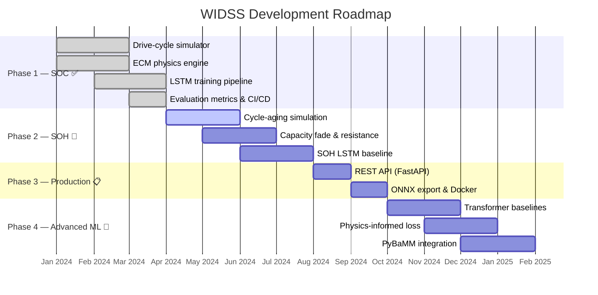

<div align="center">

<!-- Hero Banner -->


# ⚡ WIDSS

### **W**indowed **I**ntelligent **D**rive-cycle **S**tate e**S**timation

*A modular, open-source framework for AI-driven battery State-of-Charge (SOC)*  
*and State-of-Health (SOH) estimation under realistic EV drive cycles.*

<br>

[](https://www.python.org/)
[](LICENSE)
[](https://github.com/pritam-09-ops/WIDSS/actions/workflows/tests.yml)
[](https://github.com/pritam-09-ops/WIDSS/actions/workflows/lint.yml)
[](https://github.com/psf/black)
[](https://pycqa.github.io/isort/)

<br>

[**Getting Started**](#-getting-started) · [**Features**](#-features) · [**Architecture**](#-how-it-works) · [**API Reference**](#-api-reference) · [**Results**](#-results) · [**Roadmap**](#%EF%B8%8F-roadmap)

</div>

<br>

---

<br>

## 📖 Overview

**WIDSS** bridges the gap between physics-based battery modelling and modern deep learning to deliver accurate, real-time **State of Charge (SOC)** estimation for electric vehicles.

The framework is fully modular — use only the physics simulator, plug in your own ML models, or run the complete LSTM pipeline end-to-end — all from a clean Python API.

> [!NOTE]
> **State of Health (SOH)** prediction — modelling long-term capacity fade and resistance growth — is actively under development. See the [Roadmap](#%EF%B8%8F-roadmap) for details.

<br>

## 🎯 Who Is This For?

| Audience | Why WIDSS? |
|:--|:--|
| 🔧 **EV Engineers** | Reliable, testable SOC baseline for battery management systems |
| 🔬 **Battery Researchers** | Explore physics + ML synergies with pluggable components |
| 🎓 **Students & Learners** | Learn BMS fundamentals and time-series deep learning hands-on |
| 🛠️ **DIY Enthusiasts** | Smarter monitoring for custom battery packs |

> You do **not** need to be a deep learning expert. The simulator runs without TensorFlow, and the ML workflow is entirely optional.

<br>

---

<br>

## ✨ Features

| Capability | Status |
|:--|:--:|
| Realistic EV drive-cycle simulator (idle · cruise · accel · regen) | ✅ Ready |
| Physics-based ECM battery simulation (SOC & voltage) | ✅ Ready |
| Sliding-window dataset builder for sequence models | ✅ Ready |
| LSTM neural network (TensorFlow / Keras) | ✅ Ready |
| Standard evaluation metrics (RMSE · MAE · MAPE) | ✅ Ready |
| Multi-Python CI/CD (3.10 · 3.11 · 3.12) | ✅ Ready |
| Battery degradation prediction (SOH) — capacity fade & resistance growth | ✅ Ready |
| PyBaMM electrochemistry integration | 📋 Planned |
| Transformer & physics-informed baselines | 📋 Planned |

<br>

---

<br>

## 🏗 How It Works

WIDSS follows a clean **three-stage pipeline** architecture:

```
┌─────────────┐     ┌──────────────────┐     ┌────────────────────┐     ┌──────────────┐     ┌────────────────┐
│  🔋 Battery │────▶│  ⚙️ Physics Sim   │────▶│  📊 Window Builder │────▶│  🧠 LSTM     │────▶│  📈 SOC        │
│  Parameters │     │  (simulation.py) │     │  (dataset.py)      │     │  (model.py)  │     │  Prediction    │
└─────────────┘     └──────────────────┘     └────────────────────┘     └──────────────┘     └────────────────┘
```

<details>
<summary><b>🔍 Click to expand — Stage-by-stage explanation</b></summary>

<br>

### Stage 1 · Physics Simulation — `simulation.py`

Models your battery using an **Equivalent Circuit Model (ECM)** — a voltage source with internal resistance. Feed in battery specs and a realistic drive cycle → out comes current/voltage/SOC timeseries.

```
V_terminal = OCV(SOC) − I × R_internal
```

### Stage 2 · Dataset Builder — `dataset.py`

Chops the timeseries into **sliding windows**. Each window contains *N* timesteps of `[voltage, current]` with a label: the SOC value one step ahead. This is how we create supervised training data for the neural network.

### Stage 3 · LSTM Model — `model.py`

A **recurrent neural network** that learns temporal patterns between voltage, current, and SOC. It "remembers" recent history to make predictions that outperform traditional Coulomb counting.

<br>

> **Why modular?** You can swap any stage independently — use a different physics model, bring your own ML architecture, or feed in real sensor data without rewriting the rest of the pipeline.

</details>

<br>

---

<br>

## 🚀 Getting Started

### Prerequisites

- **Python** 3.10, 3.11, or 3.12
- **pip** ≥ 21

### Installation

```bash
# Clone the repository
git clone https://github.com/pritam-09-ops/WIDSS.git
cd WIDSS

# Install core package (simulation + dataset builder)
pip install -e .

# Add LSTM training support (TensorFlow)
pip install -e ".[tensorflow]"

# Full development setup (testing, linting, type checking)
pip install -e ".[all]"
```

### Quick Start — 5 Minutes ⏱️

**1. Simulate battery data**
```python
from widss.simulation import build_dataset

# Simulate 1 hour of realistic EV driving
df = build_dataset(duration_s=3600, seed=42)
print(df.head())
#    time_s  current_a  voltage_v       soc
# 0     0.0   5.234291   4.175419  0.950000
# 1     1.0   4.896742   4.176384  0.949976
# ...
```

**2. Build ML-ready sequences**
```python
from widss.dataset import build_sequences

x, y = build_sequences(df, window_size=30)
print(x.shape, y.shape)
# (3539, 30, 2)  (3539,)
```

**3. Train the LSTM**
```bash
python scripts/train_soc_lstm.py \
    --duration-s 7200 --window-size 30 --epochs 10 \
    --units 128 --learning-rate 0.0005 \
    --output-dir runs/first_run
```

**4. Validate**
```bash
python -m pytest
```

### Phase 2: SOH Prediction ⚡

Train a model to predict battery State-of-Health from cycle degradation:

```bash
python scripts/train_soh_lstm.py \
    --cycles 100 --window-size 10 --epochs 5 \
    --capacity-fade-rate 0.02 --resistance-growth-rate 0.01 \
    --output-dir runs/soh_run
```

<br>

---

<br>

## 🧪 Understanding the Concepts

<details>
<summary><b>⚡ State of Charge (SOC)</b></summary>

<br>

SOC represents the percentage of usable energy remaining in the battery (`0.0` = empty, `1.0` = fully charged). Accurate SOC is critical for reliable range prediction in EVs.

**Traditional approach — Coulomb Counting:** Integrate current over time. Simple in theory, but drifts significantly due to sensor noise, temperature variations, and cannot capture recovery effects during rest periods.

**WIDSS approach — LSTM:** Learns the nonlinear relationship between voltage, current, and SOC from data, capturing temporal patterns that raw integration misses.

</details>

<details>
<summary><b>🔋 Battery Model (Equivalent Circuit)</b></summary>

<br>

The battery is modelled as a voltage source (Open-Circuit Voltage, OCV) in series with internal resistance:

```
V_terminal = OCV(SOC) − I × R_internal
```

The OCV varies with SOC (higher charge → higher voltage), approximated with a linear function. This first-order ECM is surprisingly accurate for most practical BMS scenarios.

</details>

<details>
<summary><b>🛣️ Drive Cycles</b></summary>

<br>

WIDSS generates realistic current profiles composed of:
- **Acceleration bursts** — High current draw
- **Steady cruising** — Moderate, sustained load
- **Regenerative braking** — Negative current (charging)
- **Idle periods** — Minimal current

Profiles are deterministic but parameterizable: same configuration + different seed = different drive pattern.

</details>

<br>

---

<br>

## 📚 API Reference

### `widss.simulation`

> Synthetic EV drive-cycle generation and battery electrical simulation.

```python
from widss.simulation import BatterySimulationConfig, build_dataset

cfg = BatterySimulationConfig(
    capacity_ah=60.0,      # 60 Ah pack
    soc_init=0.95,         # Start at 95% charge
    dt_s=1.0               # 1-second timesteps
)

frame = build_dataset(duration_s=3600, config=cfg, seed=42)
# Returns DataFrame: [time_s, current_a, voltage_v, soc]
```

---

### `widss.dataset`

> Converts raw timeseries into sliding-window training sequences.

```python
from widss.dataset import build_sequences

x, y = build_sequences(
    frame,
    feature_cols=("voltage_v", "current_a"),
    window_size=30
)
# x shape: (num_windows, 30, 2) — input features
# y shape: (num_windows,)       — target SOC
```

---

### `widss.degradation` — NEW (Phase 2)

> Battery aging simulation and State-of-Health label generation.

```python
from widss.degradation import (
    BatteryDegradationConfig,
    build_degradation_profile,
    compute_soh,
    extract_cycle_features,
)

# Simulate capacity fade and resistance growth over 500 cycles
cfg = BatteryDegradationConfig(
    capacity_init_ah=60.0,
    capacity_fade_rate=0.02,
    resistance_growth_rate=0.01
)

capacity_ah, resistance_ohm = build_degradation_profile(cycles=500, config=cfg)

# Compute SOH (State of Health) as capacity retention
soh = compute_soh(capacity_current_ah=48.0, capacity_init_ah=60.0)
print(f"SOH: {100 * soh:.1f}%")  # SOH: 80.0%

# Extract features from a single cycle
avg_current = 15.0
max_current = 50.0
avg_voltage = 4.0
soc_delta = 0.5

features = extract_cycle_features(
    cycle_current=np.array([...]),
    cycle_voltage=np.array([...]),
    cycle_soc=np.array([...])
)
# Returns: {'avg_current_a', 'max_current_a', 'avg_voltage_v', 'soc_delta', 'energy_wh'}
```

---

### `widss.dataset` (Extended for SOH)

> Cycle-level sliding-window builder for SOH prediction.

```python
from widss.dataset import build_cycle_sequences
import pandas as pd

# Cycle-level data with aggregate features
cycles_df = pd.DataFrame({
    'cycle_num': np.arange(100),
    'avg_current_a': np.random.uniform(5, 20, 100),
    'max_current_a': np.random.uniform(20, 80, 100),
    'avg_voltage_v': np.linspace(4.2, 3.5, 100),
    'soc_delta': np.random.uniform(0.5, 1.0, 100),
    'soh': np.linspace(1.0, 0.8, 100),
})

x, y = build_cycle_sequences(cycles_df, window_size=10)
# x shape: (num_windows, 10, 5) — cycle features over 10-cycle windows
# y shape: (num_windows,)        — target SOH values
```

---

### `widss.model` (Extended for SOH)

> LSTM architectures for SOC and SOH prediction (requires TensorFlow).

```python
from widss.model import build_lstm_soc_model, build_lstm_soh_model, tensorflow_available

if tensorflow_available():
    # SOC model (timestep-level)
    soc_model = build_lstm_soc_model(
        window_size=30,
        feature_count=2,
        units=64
    )
    
    # SOH model (cycle-level)
    soh_model = build_lstm_soh_model(
        window_size=10,
        feature_count=5,
        units=32
    )
```

---

### `widss.evaluation`

> Standard ML evaluation metrics.

```python
import numpy as np
from widss.evaluation import rmse, mae, mape

y_true = np.array([0.9, 0.8, 0.7, 0.6])
y_pred = np.array([0.88, 0.81, 0.69, 0.62])

print(f"RMSE: {rmse(y_true, y_pred):.4f}")
print(f"MAE:  {mae(y_true, y_pred):.4f}")
print(f"MAPE: {mape(y_true, y_pred):.2f}%")
```

<br>

---

<br>

## ⚙️ Configuration

### Battery Parameters — `BatterySimulationConfig`

| Parameter | Default | Description | Typical Range |
|:--|:--:|:--|:--|
| `capacity_ah` | `60.0` Ah | Total battery capacity | 40 – 100 Ah (EV packs) |
| `soc_init` | `0.95` | Starting charge level | 0.5 – 0.95 |
| `dt_s` | `1.0` s | Simulation timestep | 0.1 – 5.0 s |
| `internal_resistance_ohm` | `0.02` Ω | Battery internal resistance | 0.01 – 0.1 Ω |
| `ocv_min_v` | `3.0` V | Minimum voltage (empty) | 2.5 – 3.2 V (Li-ion) |
| `ocv_max_v` | `4.2` V | Maximum voltage (full) | 4.0 – 4.3 V (Li-ion) |

### Training Parameters

```bash
python scripts/train_soc_lstm.py [options]
```

| Option | Default | Description |
|:--|:--:|:--|
| `--duration-s` | `7200` | Simulation duration (seconds) |
| `--dt-s` | `1.0` | Timestep size |
| `--window-size` | `30` | Input window length for LSTM |
| `--epochs` | `5` | Training rounds |
| `--batch-size` | `64` | Samples per gradient update |
| `--units` | `64` | Number of LSTM hidden units |
| `--learning-rate` | `1e-3` | Adam optimizer learning rate |
| `--seed` | `42` | Random seed for reproducibility |
| `--output-dir` | `outputs/` | Model and artifact output path |

### Training Examples

```bash
# Quick smoke test (~ 2 min)
python scripts/train_soc_lstm.py --duration-s 300 --epochs 5

# Standard training run
python scripts/train_soc_lstm.py --duration-s 7200 --epochs 10 --units 64

# Full training with extended data
python scripts/train_soc_lstm.py \
    --duration-s 14400 --epochs 20 --batch-size 32 --window-size 60 \
    --units 128 --learning-rate 0.0005
```

### Output Artifacts

Each training run saves three files to `--output-dir`:

| File | Purpose |
|:--|:--|
| `soc_lstm.keras` | Trained model — ready for inference |
| `history_loss.npy` | Numpy array of per-epoch training loss |
| `training_summary.json` | Full run config + final metrics |

<details>
<summary><b>📄 Example <code>training_summary.json</code></b></summary>

```json
{
  "duration_s": 7200,
  "dt_s": 1.0,
  "window_size": 30,
  "epochs": 10,
  "batch_size": 64,
  "units": 64,
  "learning_rate": 0.001,
  "train_samples": 5736,
  "val_samples": 1434,
  "final_loss": 0.000182,
  "final_val_loss": 0.000215,
  "final_rmse": 0.0135,
  "final_val_rmse": 0.0147
}
```

</details>

<br>

---

<br>

## 💡 Tips & Best Practices

| Question | Guidance |
|:--|:--|
| **How to choose `units`?** | Start with `64`. If MAPE > 5%, try `128`. Higher rarely helps without more data. |
| **How to choose `window_size`?** | For 1 Hz data, **30–60 seconds** is the sweet spot. Larger = more context but slower training. |
| **How to read `final_val_rmse`?** | Measures average prediction error on a 0–1 scale. A value of `0.015` = **±1.5% SOC error**. |
| **Overfitting signs?** | `val_loss` >> `train_loss`. Fix: reduce `units`, add more data, or try early stopping. |

<br>

---

<br>

## 📊 Results

### Benchmark Snapshot — Synthetic Data

> Measured on synthetic battery data: 2 hours of driving, 60 Ah Li-ion cell.

| Model | Avg MAPE | Inference Speed | Model Size |
|:--|:--:|:--:|:--:|
| **LSTM (128 units)** | **~2.8%** | 🟡 Moderate | 4.2 MB |
| LSTM (64 units) | ~3.2% | 🟢 Fast | 2.1 MB |
| Linear baseline | ~8.7% | 🟢🟢 Very fast | 0.01 MB |

### Reproducible Run

```bash
python scripts/train_soc_lstm.py --duration-s 7200 --epochs 10 --units 64 --seed 42
```

```json
{
  "final_loss": 0.000182,
  "final_val_loss": 0.000215,
  "final_rmse": 0.0135,
  "final_val_rmse": 0.0147
}
```

> [!IMPORTANT]
> These benchmarks use **clean, synthetic data**. Real-world performance depends on sensor quality, battery aging, temperature, and operating conditions. Always validate on your own data before deployment.

<br>

---

<br>

## 📁 Project Structure

```
WIDSS/
├── src/widss/
│   ├── __init__.py              # Package metadata & version
│   ├── simulation.py            # Drive cycle generation & battery physics
│   ├── dataset.py               # Sliding-window sequence builder
│   ├── model.py                 # LSTM architecture (TensorFlow/Keras)
│   └── evaluation.py            # Metrics: RMSE, MAE, MAPE
├── tests/
│   ├── test_simulation.py       # Battery simulator tests
│   ├── test_dataset.py          # Dataset builder tests
│   ├── test_model.py            # Model architecture tests
│   └── test_evaluation.py       # Metrics tests
├── scripts/
│   └── train_soc_lstm.py        # End-to-end training CLI
├── .github/
│   ├── workflows/
│   │   ├── tests.yml            # CI: pytest (Python 3.10 / 3.11 / 3.12)
│   │   └── lint.yml             # CI: Black + flake8 + isort + mypy
│   └── ISSUE_TEMPLATE/          # Bug report & feature request templates
├── pyproject.toml               # Build config & tool settings
├── CONTRIBUTING.md              # Contribution guidelines
├── CHANGELOG.md                 # Version history
├── requirements.txt             # Pinned dependencies
└── LICENSE                      # MIT License
```

<br>

---

<br>

## 🗺️ Roadmap



| Phase | Focus | Status |
|:--|:--|:--:|
| **Phase 1** | SOC prediction — simulator, ECM, LSTM, metrics, CI | ✅ Complete |
| **Phase 2** | SOH — cycle aging, capacity fade, resistance growth | 🚧 In Progress |
| **Phase 3** | Production — REST API, ONNX export, Docker | 📋 Planned |
| **Phase 4** | Advanced ML — Transformers, physics-informed loss, PyBaMM | 🔮 Future |

<br>

---

<br>

## ❓ FAQ

<details>
<summary><b>Do I need TensorFlow for everything?</b></summary>

No. The simulator and dataset builder are **pure Python** (NumPy + Pandas only). TensorFlow is only required for LSTM training: `pip install tensorflow>=2.13`.

</details>

<details>
<summary><b>Can I use real battery data instead of simulated?</b></summary>

Absolutely. Format your data as a DataFrame with columns `time_s`, `current_a`, `voltage_v`, and `soc`, then pass it directly to `build_sequences()`. Real-data loaders are on the roadmap.

</details>

<details>
<summary><b>Is this production-ready?</b></summary>

The architecture is solid for research and prototyping. Production deployment requires thorough validation on your specific battery chemistry and operating conditions. ONNX export (Phase 3) will simplify embedded deployment.

</details>

<details>
<summary><b>What battery chemistries are supported?</b></summary>

Currently generic Li-ion. LFP, NCA, and NMC support is planned. The OCV-SOC curve is pluggable, making chemistry-specific models straightforward to add.

</details>

<br>

---

<br>

## 🤝 Contributing

Contributions are welcome! Whether it's a bug fix, feature, documentation improvement, or test coverage — check out [**CONTRIBUTING.md**](CONTRIBUTING.md) for the full process.

For significant changes, please [open an issue](https://github.com/pritam-09-ops/WIDSS/issues) first to discuss the direction.

<br>

## 📄 License

[MIT License](LICENSE) — use it however you want.

<br>

## 💬 Get In Touch

| Channel | Link |
|:--|:--|
| 🐛 **Bug Reports** | [Open an Issue](https://github.com/pritam-09-ops/WIDSS/issues) |
| 💡 **Feature Ideas** | [Start a Discussion](https://github.com/pritam-09-ops/WIDSS/discussions) |
| 🤝 **Contribute** | [CONTRIBUTING.md](CONTRIBUTING.md) |

---

<div align="center">

<br>

**Built with ⚡ by [Pritam](https://github.com/pritam-09-ops) · IIT Bombay**

*If you find WIDSS useful, consider giving it a ⭐ — it helps others discover the project!*

<br>

</div>
